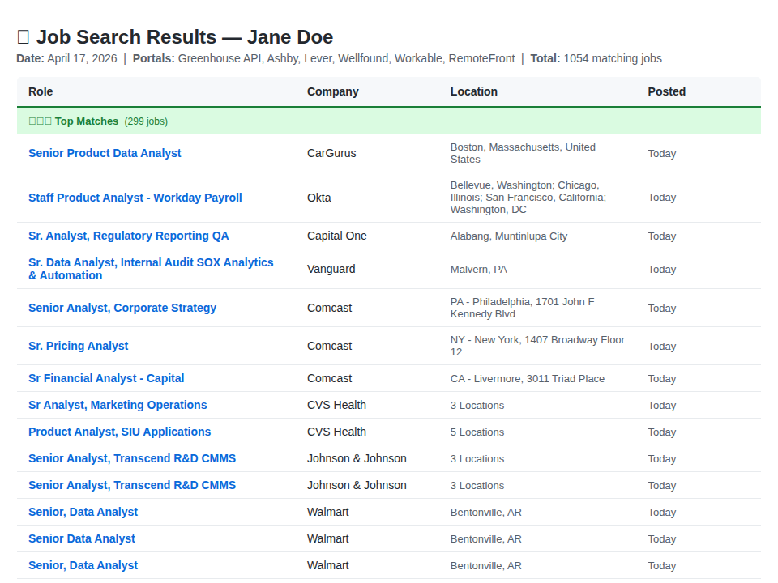

# JobClaw — Multi-Source Job Pipeline

🦞 **AI-powered job search pipeline for agents & humans** — Greenhouse, Lever, Workday APIs, visa sponsorship filtering, tiered reports. Works with OpenClaw, Claude Code, or standalone CLI.

**No LLM black boxes.** All filtering is deterministic Python — keyword matching, location rules, experience thresholds, and sponsorship exclusion logic.

**Two ways to use:** as a standalone CLI, or as an OpenClaw skill (see `SKILL.md`).

## Features

- ✅ **3 ATS sources**: Greenhouse (100+ companies), Lever (80+ companies), Workday (50+ companies)
- ✅ **Full job descriptions** fetched in parallel (Greenhouse + Lever via API, Workday via Playwright rendering)
- ✅ **Profile-driven filtering**: title tiers, experience caps, location rules, visa/sponsorship exclusions
- ✅ **ITAR/security clearance exclusion**: skips jobs requiring U.S. citizenship or clearance
- ✅ **HTML reports** — tiered (⭐⭐⭐ / ⭐⭐ / ⭐), email-ready
- ✅ **Google Sheet sync** via gog CLI (optional)
- ✅ **Workday URL caching** for incremental rendering (saves ~9 min on re-runs)
- ✅ **Parallel fetching** — ThreadPoolExecutor for API calls, async Playwright for Workday



---

## Usage as CLI

### Install

```bash
git clone https://github.com/art22s/JobClaw.git
cd JobClaw
pip install playwright pymupdf
playwright install chromium
```

### Create a Profile

Copy the example and edit, or create from scratch:

```bash
cp profiles/example.md profiles/yourname.md
# Edit profiles/yourname.md with your details
```

### Run the Pipeline

```bash
# Full pipeline (fetch → filter → report → sheet)
python3 job_search.py run --profile profiles/yourname.md

# Individual steps
python3 job_search.py fetch --profile profiles/yourname.md --source all
python3 job_search.py filter --profile profiles/yourname.md
python3 job_search.py report --profile profiles/yourname.md
```

### CLI Commands

| Command | Description |
|---------|-------------|
| `run` | Full pipeline: fetch → filter → report → sheet |
| `fetch` | Fetch jobs from one or all sources |
| `filter` | Filter fetched jobs against profile |
| `report` | Generate HTML report from filtered jobs |
| `sheet` | Sync filtered jobs to Google Sheet |

### Key Options

- `--profile` — Path to candidate profile (.md)
- `--source` — Which ATS to fetch: `greenhouse`, `lever`, `workday`, `all`
- `--max-days` — Max job age in days (default: 30)
- `--max-per-company` — Cap jobs per company (default: 20)
- `--no-sheet` — Skip Google Sheet sync during `run`
- `--timeout` — Per-request timeout in seconds (default: 30)

### (Optional) Google Sheet Sync

```bash
gog auth login
gog auth tokens export --out config/gog_token.json
```

Set your sheet ID via one of:
- Environment variable: `export JOBCLAW_SHEET_ID=your-sheet-id`
- CLI arg: `--sheet-id your-sheet-id`
- Config file: add `{"sheet_id": "your-sheet-id"}` to `config/config.json`

### Configuration

| Env Variable | Default | Description |
|---|---|---|
| `JOBCLAW_CONFIG_DIR` | `config/` | Path to config directory |
| `JOBCLAW_SHEET_ID` | _(none)_ | Google Sheet ID for sync |
| `GOG_CRED_PATH` | `~/.config/gogcli/credentials.json` | gog CLI credentials |

---

## Usage as OpenClaw Skill

Install this project as an OpenClaw skill. When triggered, the agent follows `SKILL.md` which covers the full workflow:

1. **Create Profile** — agent reads your PDF resume, asks for immigration status and location, generates a structured profile using its own AI (no extra API keys)
2. **Fetch Jobs** — runs Greenhouse, Lever, Workday fetchers
3. **Filter** — applies title/sponsorship/location/experience filters
4. **Generate Report** — tiered HTML with clickable links
5. **Sync Sheet** — updates Google Sheet
6. **Send Email** — optional, if requested

To install as a skill, place this directory in your OpenClaw workspace's `skills/` folder or install via ClawHub.

---

## Profile Format

Profiles are Markdown files with structured sections:

```markdown
# Your Name - JobClaw Profile

## Contact
- **Name:** Jane Doe
- **Email:** jane@example.com

## Search Keywords
- data analyst
- senior data analyst
- business intelligence analyst
- analytics engineer

## Target Locations
- United States (US only)

## Exclusions
### Text-Based Exclusions
- ❌ Skip jobs that explicitly state "no visa sponsorship"
- ❌ Skip jobs that require US citizenship or security clearance

## Job Preferences
- **Level:** Senior / Mid-Senior
- **Visa:** Requires H1B sponsorship
```

See `profiles/example.md` for a complete example.

## Filtering Logic

### Title Tiers
- **⭐⭐⭐ Tier 3**: Exact role matches (Data Analyst, Senior Data Analyst, BI Analyst, BI Engineer)
- **⭐⭐ Tier 2**: Close variants (Product Analyst, Growth Analyst, Analytics Engineer, Financial Analyst)
- **⭐ Tier 1**: Partial matches (anything with "analyst", "analytics", "BI", "insights", "reporting")

### Experience Filtering
- **Hard reject**: VP/C-level, Director, Principal titles; PhD requirement; 8+ years experience
- **Pass but flag**: Staff titles, Manager-of-analytics titles; 6–7 years experience

### Sponsorship Filtering
- Scans job descriptions for 20+ "no sponsorship" phrases
- Excludes ITAR/export regulation jobs requiring U.S. citizenship
- Excludes security clearance requirements

### Location Filtering
- US-only mode rejects jobs in 40+ non-US countries/regions
- Word-boundary matching prevents false positives (e.g., "indianapolis" ≠ "india")

## Architecture

```
JobClaw/
├── SKILL.md               # OpenClaw skill instructions
├── job_search.py          # CLI entry point
├── scripts/
│   ├── fetch_greenhouse.py    # Greenhouse API (100+ companies)
│   ├── fetch_lever.py         # Lever Postings API (80+ companies)
│   ├── fetch_workday.py       # Workday internal API (50+ companies)
│   ├── fetch_websearch.py     # Web search aggregator
│   ├── filter_jobs.py         # Core filtering + ranking engine
│   ├── generate_report.py     # HTML report generator
│   └── update_sheet.py        # Google Sheet sync via gog CLI
├── profiles/
│   └── example.md             # Example candidate profile
├── assets/
│   └── profile_template.md    # Template for AI-generated profiles
├── reports/                   # Generated HTML reports
└── config/                    # Configuration files
```

## API Notes

- **Greenhouse**: `GET /v1/boards/{slug}/jobs` — no auth, returns structured JSON
- **Lever**: `GET /v0/postings/{slug}?mode=json` — no auth, returns full descriptions
- **Workday**: `POST /wday/cxs/{tenant}/{site}/jobs` — undocumented but stable internal API

## Requirements

- Python 3.10+
- **For Workday rendering**: Playwright + Chromium (`pip install playwright && playwright install chromium`)
- **For Google Sheet sync**: gog CLI with authenticated Google account

## License

MIT
